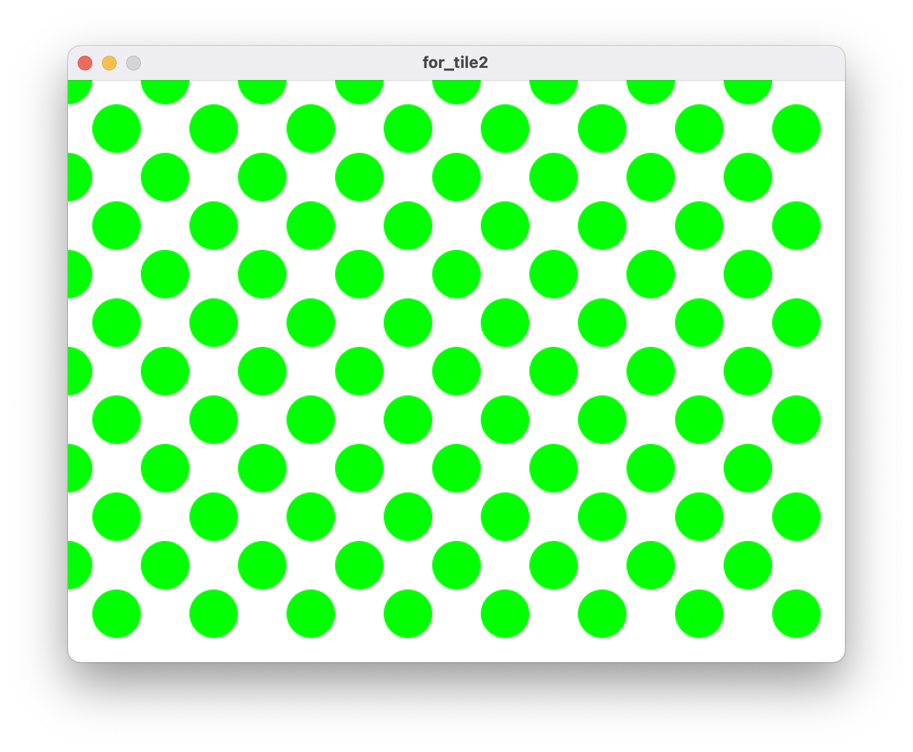

<!-- _class: lead -->
# OpenLab Autumn Workshop
## 【1】再帰アルゴリズムで絵画を描く

---
<!-- _class: lead -->
# 基本編
- 図形
- テキスト
- 色
- 線の色/太さ
- BlendMode
- 画像の挿入

---
### 図形

```javaScript
function setup() {
  createCanvas(800, 800);//画面サイズ
  background(255); //背景
  
  rect(0,0,100,100);  //四角
  ellipse(200,200,100,100);  //円
  triangle(300,200, 200,300, 400,300);  //三角
}
```
---
### 図形


---
### 色と線
```javaScript
function setup() {
  createCanvas(800, 800);//画面サイズ
  background(255); //背景
  
  fill(255,0,0); //塗りつぶし(R, G, B)
  stroke(0,0,255);  //線の色(R, G, B)
  rect(0,0,100,100);  //四角
  
  fill(0,255,0);
  noStroke();  //線無し
  ellipse(200,200,100,100);  //円
  
  noFill();  //塗りなし
  stroke(0);
  strokeWeight(10); //線の太さ
  triangle(300,200, 200,300, 400,300);  //三角
}
```
---
### 色と線


---
### Blend Mode (色の重なり)
```javaScript
function setup() {
    createCanvas(800, 800);//画面サイズ
    background(255);
    blendMode(BLEND);//通常
    //blendMode(DIFFERENCE);//色を引く
    //background(0);
    //blendMode(ADD);//色を足す
    //blendMode(LIGHTEST);//大きい値を優先
    
    noFill();
    fill(255,0,0); 
    ellipse(100, 100, 200, 200);
   
    fill(0,255,0); 
    ellipse(200, 100, 200, 200);
    
    fill(0,0,255); 
    ellipse(300, 100, 200, 200);
    
    fill(255); 
    ellipse(400, 100, 200, 200);
}


```

---
### Blend Mode (色の重なり)


[参考：ProcessingのblendMode()の使い方](https://aa-deb.hatenablog.com/entry/2016/11/03/181953)

---
### テキスト
```javaScript
function setup() {
  createCanvas(800, 800);//画面サイズ
  background(255);
  
  fill(0);
  textSize(100);
  text("Hello", 0,100);
}
```
---
### テキスト


---
### 画像
使いたい画像をProcessingのスケッチにドラッグする


---
### 画像
```javaScript
let img; //画像を使うための変数

function preload(){
  img = loadImage("画像の名前");//画像のロード
}

function setup() {
  createCanvas(800, 800);//画面サイズ 
  background(0);
  image(img, 0,0, 640, 480);//画像の表示
  //image(画像、始点X、始点Y、横幅、縦幅);
}
```
---
### 画像


---
<!-- _class: lead -->
# 応用編(再帰アルゴリズム)
- 横の繰り返し
  - ストライプ
  - グラデーション
- 横と縦の繰り返し
  - タイル
  - グリッド
- 回転の繰り返し
  - 魔法陣

---
### 横の繰り返しの前に座標移動
右の様に四角を横に並べたいとき


<!-- _class: lead -->
<!--  -->
```java
  rect(0,0,80,80);
  rect(160,0,80,80);
  rect(320,0,80,80);
  rect(480,0,80,80);
```
こう描くことができる。しかし、これがさらに多くなってくると書くのがめんどくさい ...

---
### 横の繰り返しの前に座標移動
そんな時は、for文(繰り返し)で書く事もできる。
```javaScript
function setup() {
  createCanvas(800, 800);//画面サイズ 
  background(255);
  fill(0);
  for (let x=0; x < width; x+=160) {
    rect(x, 0, 80, 80);
  }
}
```

---
### 横の繰り返しでストライプを描こう
色や間隔は好きな値に変更しよう。
```javaScript
function setup() {
  createCanvas(800, 800);//画面サイズ 
  background(255);
  fill(0,0,255);
  for (let x=0; x < width; x+=60) {
    rect(x, 0, 30,height);
  }
}
```

---
### 横の繰り返しでストライプを描こう


---
### 横の繰り返しでグラデーション
```javaScript
function setup() {
  createCanvas(800, 800);//画面サイズ 
  background(255);
  noStroke();

  for (let x=0; x < 255; x+= 1) {
    fill(0, 0, x);
    rect(x * width/255, 0, 10, height);
  }
}
```
---
### 横の繰り返しでグラデーション


---
### 縦と横の繰り返し
```javaScript
function setup() {
  createCanvas(800, 800);//画面サイズ 
  background(255);
  noStroke();

  for (let y=20; y < height; y+=80) { //縦の繰り返し
    fill(0, 0, 255); //色を変えてみて
    rect(0, y, width, 40);
  }
  for (let x=20; x < width; x+=80) {　//横の繰り返し
    fill(0, 0, 255);
    rect(x, 0, 40, height);
  }

}
```
---
### 横と縦の繰り返し


---
### 縦と横の繰り返しでタイリング
```javaScript
function setup() {
  createCanvas(800, 800);//画面サイズ 
  background(255);
  noStroke();
  for (let y=0; y < height; y+=80) {
    for (let x=0; x < width; x+=80) {
      fill(0, 255, 0);
      rect(x, y, 40, 40);
    }
  }
}
```
---
### 


---
### 横と縦の繰り返しでグリット
```javaScript
function setup() {
  createCanvas(800, 800);//画面サイズ 
  background(255);
  noStroke();

  let count = 0;　//段数を数える変数
  for (let y=0; y < height; y+=40) {
    for (let x=0; x < width; x+=80) {
      fill(0, 255, 0); //色を変えてみてね
      rect(x + (count%2*40), y, 40, 40);　//countが奇数の時に右に40ずらす
    }
    count += 1;
  }
}
```
---
### 横と縦の繰り返しでグリット


---
### グリットを他の図形にすると ...

色や図形を変更して試してみよう。画像や文字にしたり、
blendModeを使って図形を重ねても面白いかも。

---
### 回転の繰り返しの前に、回転の方法

```javaScript
  createCanvas(800, 800);//画面サイズ 
  rotate(radians(30)); //30度回転
  rect(0,0, 50, 50);
```

rotate()を使うと原点(左上)を中心に回転する。

---
### 回転の繰り返しの前に、原点の移動
原点を移動させることで、好きな位置で回転させられる。
```javaScript
  createCanvas(800, 800);//画面サイズ 
  translate(100,100); //原点の移動
  rotate(radians(30));　//30度回転
  rect(0,0, 50, 50);
  ellipse(0,0, 10, 10);　//原点に描かれる
```


---
### 回転の繰り返し
```javaScript  
function setup() {
  createCanvas(800, 800);//画面サイズ 
  noFill();
  stroke(255,0,0);
  strokeWeight(10);
  translate(width/2, height/2); //画面の中心に移動
  for (let i=0; i<360; i+=90) { //360度になるまで90度回転させる
    rotate(radians(i));
    rect(0, 0, 200, 200);
  }
}
```
---
### 回転の繰り返し
角度や色、図形を変更して試してみよう。


---
<!-- _class: lead -->
# 発展編
- ランダムに配置
- 回転の繰り返しをタイリング(縦横に配置)

---
### ランダムに配置
random()を使うと、乱数を生成できる。
```javaScript
let r1 = random(100); //0~100の乱数
let r2 = random(100, 200); //100~200の乱数
let r3 = int(random(100)); //0~100の整数の乱数
```

乱数を使って、円をランダムな位置に描いてみよう。
```javaScript
ellipse(random(width),random(height), 30, 30);
```

---
### ランダムの繰り返し
繰り返しとランダムを使って、位置や色がランダムな図形を描いてみよう。
```javaScript
function setup(){
  createCanvas(800, 800);//画面サイズ 
  background(0);
  noStroke();
  for(let i=0; i<100; i++){
    fill(random(255),random(255),random(255));
    ellipse(random(width), random(height), 100, 100);
  }
}
```
---

### ランダムの繰り返し


---
### ランダムを使って色々試してみよう。
- ランダムな大きさの図形を描く
- blendMode()＋ランダムに図形を描く
- 回転＋ランダムに図形を描く


---
### 回転の繰り返しでタイリング

関数を使って回転の工程をスタンプにする
```javaScript
function stamp(x, y) {　//スタンプ関数を作る
  push(); //座標系の保存
  translate(x, y);
  for (let i=0; i<360; i+=45) {
    rotate(radians(i));
    fill(0,200,200);
    rect(0,0,30,10);
  }
  pop();
}
//次のページに続く

```

---
```javaScript
function setup(){
  createCanvas(800, 800);//画面サイズ 
  background(255);
  noStroke();
  for (let y=30; y < height; y+=80) {
    for (let x=30; x < width; x+=80) {
      fill(0, 255, 0); //色を変えてみて
      stamp(x, y);　//スタンプを配置
    }
  }
}
```


---
### 回転の繰り返しでタイリング


---### 
```java

```
---
### 回転の繰り返しで遊んでみよう
図形や色や繰り返しの回数などを変更して、色々試してみよう。


