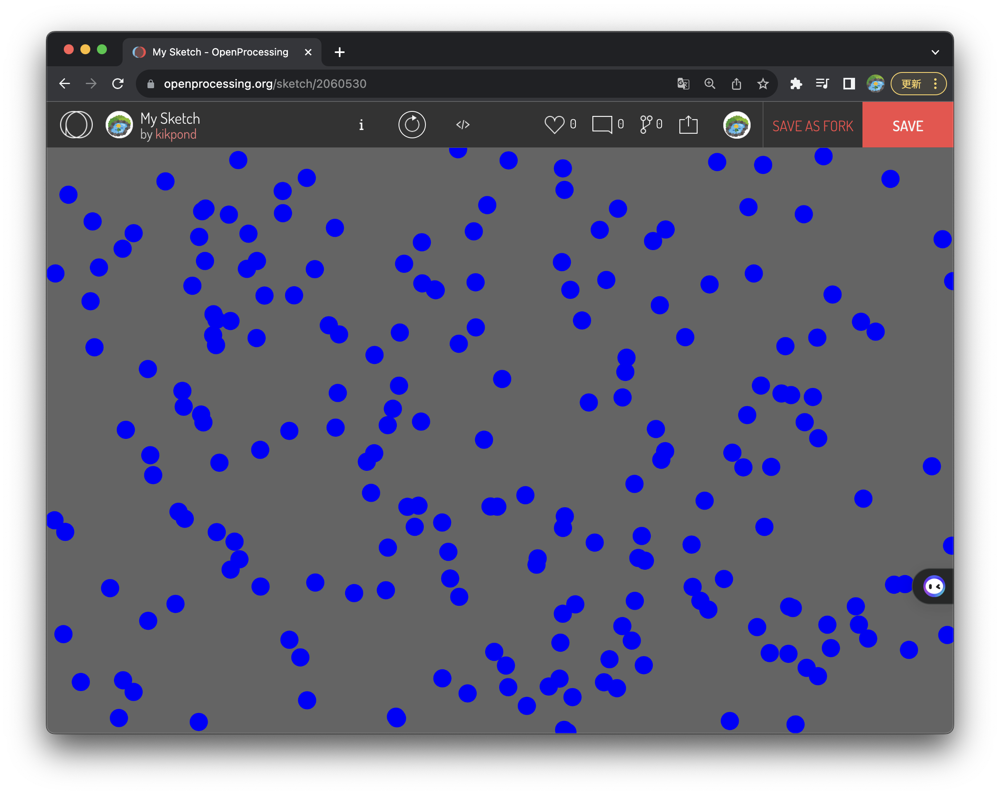

<!-- _class: lead -->
# OpenLab Autumn Workshop
## 【2】アニメーションを用いた絵画を描く

---
<!-- _class: lead -->

# 目次（基本編）

- draw関数でアニメーション
    - mouseでドローイング
    - ランダムな位置に図形生成
    - 座標の縦横移動
    - 跳ね返り
    - 縦ループ
    - 回転の繰り返し

---
<!-- _class: lead -->
# 目次（応用編）
- ランダムウォークでドローイング
    - ランダムな移動
    - 筆の変更(図形、色)
- 縦ループに配列を使って、落ちてくる数を増やす
    - 配列を作る

---
<!-- _class: lead -->
# 目次（発展編）
- 縦ループを使って落ちる動きを表現する
    - 落ちる物体を作る
    - 落ちる動きとルールを作る
- ランダムウォークに配列を使い且つ動きを工夫する。
    - walker関数を作って、動きのルールを作る
    - 配列にする。
--- 

<!-- _class: lead -->
# 基本編
## draw関数でアニメーション
---
#### mouseでドローイング

```javaScript
function setup() { //1回だけ実行される
	createCanvas(windowWidth, windowHeight);
	background(100);
}
function draw() {　//繰り返し実行される
	noStroke();
	fill(0, 0, 255);
	//fill(random(255),random(255),random(255));
	circle(mouseX, mouseY, 20);
	//rect(mouseX, mouseY, 20, 20);
}
```
---


---
#### ランダムな位置に図形生成
```javaScript
function setup() { //1回だけ実行される
	createCanvas(windowWidth, windowHeight);
	background(100);
}
function draw() {　//繰り返し実行される
	noStroke();
	fill(0, 0, 255);
	//fill(random(255),random(255),random(255));
	circle(random(width), random(height), 20);
}
```
---


---
#### 座標の縦横移動
```javaScript
let x=0;
let y=200;
function setup() { //1回だけ実行される
	createCanvas(windowWidth, windowHeight);
	background(100);
}
function draw() {　//繰り返し実行される
	fill(0, 0, 255);
	x += 1;
	//y += 1;
	circle(x, y, 50);
}
```
---

軌跡をなくすにはどうする？

---
#### 横の跳ね返り
```javaScript
let x=0;
let y=200;
let speed = 5;
function setup() { //1回だけ実行される
	createCanvas(windowWidth, windowHeight);
}
function draw() {　//繰り返し実行される
	background(100);
	fill(0, 0, 255);
	if(width < x || x < 0){
		speed *=-1;
	}
	x += speed;
	circle(x, y, 50);
}
```

---
#### 縦横の跳ね返り
```javaScript
let x=0, y=200;
let speedX = 5, speedY = 5;
function setup() {
	createCanvas(windowWidth, windowHeight);
}
function draw() {
	background(100);　//コメントアウトするとどうなる？
	fill(0, 0, 255);
	if(width < x || x < 0) speedX *=-1;
	if(height < y || y < 0) speedY *=-1;
	x += speedX;
	y += speedY;
	circle(x, y, 50);
}
```
---
跳ね返りを利用して線を描くにはどうする？


---
#### 縦ループ
```javaScript
let x=200, y=200;
let speedY = 5;
function setup() {
	createCanvas(windowWidth, windowHeight);
	fill(random(255), random(255), random(255));
}
function draw() {
	background(100);
	if(height+100 < y){
		y =-100;
	}
	y += speedY;
	circle(x, y, 50);
}
```
---
ループする度に色が変わるようにするにはどうする？


---
#### 回転の繰り返し
```javaScript
let dig = 0;
function setup() { //1回だけ実行される
	createCanvas(windowWidth, windowHeight);
}
function draw() {　//繰り返し実行される
	//background(100);
	translate(width/2, height/2);
	push();
	rotate(radians(dig));
	fill(0, 255, 200);
	rect(0, 0, 200, 10);
	pop();
	dig +=1;
}
```
---


---
<!-- _class: lead -->
# 応用編
## ・ランダムウォークでドローイング
## ・配列を使って落ちてくる数を増やす
---
#### 

# 目次（応用編）
- ランダムウォークでドローイング
    - ランダムな移動
    - 筆の変更(図形、色)
- 配列を使って落ちてくる数を増やす
    - 配列を作る


---
#### ランダムウォークでドローイング
```javaScript
let x, y, step;
function setup() { //1回だけ実行される
	createCanvas(windowWidth, windowHeight);
	x = width/2, y=height/2, step=10;
}
function draw() {　//繰り返し実行される
	
	x += random(-10, 10);
	y +=random(-10, 10);
	rect(x, y, 10, 10);
}
```
---


図形の形や大きさ、色や色の重なりを変更してみよう。
また、画面外から出た場合の処理も考えてみよう。

---
#### ランダムウォークでドローイング2
```javaScript
let x, y, step;
function setup() {
	createCanvas(windowWidth, windowHeight);
	x = width/2, y=height/2, step=10;
	//blendMode(ADD);
	background(0);
}
function draw() {
	//画面外に出た時の処理
	if(x < 0 || width < x || y < 0 || height < y) x = width/2, y=height/2;
	x += random(-10, 10);
	y +=random(-10, 10);
	fill(random(255), random(255), random(255));
	rect(x, y, random(10, 50));	
}
```
---


---
#### 配列を使って縦ループの落ちてくる数を増やす
```javaScript
let num = 100;
let x=[num], y=[num];
let speedY = 5;
function setup() {
	createCanvas(windowWidth, windowHeight);
	fill(random(255), random(255), random(255));
	for(let i=0; i<num; i++) x[i]=random(width), y[i]=random(-height, 0);
}
function draw() {
	background(255);
	for(let i=0; i<num; i++){
		y[i] += speedY;
		if(height+100 < y[i]){
			y[i] =random(-100, 0);
		}
	circle(x[i], y[i], 50);
	}
}
```
---


円の色が落ちてくる毎に変わるようにするにはどうする？
スピードもバラバラにするにはどうする？

---
#### 配列を使って縦ループの落ちてくる数を増やす2
```javaScript
let num = 100;
let x=[num], y=[num], speedY=[num], col=[num];
function setup() {
	createCanvas(windowWidth, windowHeight);
	fill(random(255), random(255), random(255));
	for(let i=0; i<num; i++){
		x[i]=random(width), y[i]=random(-height, 0);
		speedY[i]=random(1,10), col[i]=color(random(255),random(255),random(255));
	}
}
function draw() {
	background(100);
	for(let i=0; i<num; i++){
		if(height+100 < y[i]){
		y[i]=random(-100, 0);
		col[i]=color(random(255),random(255),random(255));
	}
	y[i] += speedY[i];
	fill(col[i]);
	circle(x[i], y[i], 50);
	}
}
```
---
 

---
<!-- _class: lead -->
# 発展編
### ・縦ループを使って落ちる動きを表現する
### ・ランダムウォークに配列を使い動きを工夫する
---
#### 

# 目次（発展編）
- 縦ループを使って落ちる動きを表現する
	- 落ちる物体を作る
  - 落ちる動きとルールを作る
- ランダムウォークに配列を使い且つ動きを工夫する
	- 配列にする
	- 動きのルールを作る

---
#### 縦ループを使って落ちる動きを表現する
**落ちてくる物の例**
雨：```line(x,y,x,y+100);```
雪：```fill(255,100); ellipse(x, y, 10, 10);```
落ち葉：```fill(255,100, 0); triangle(x, y, x-10,y+10, x+10, y+10);```
<p>


---
#### 縦ループを使って落ちる動きを表現する
**落ちる動きを作る**
落ちるスピードを変える
```speedY[i] = random(1, 5)```
揺れながら落ちる
```x[i] += random(-5, 5)```
回転しながら落ちる
```javaScript
push();
translate(x[i], y[i]);
rotate(radians(y[i]));
rect(-10,-10, 20,20);
pop();
```

---
#### ランダムウォークに配列を使う
```javaScript
let num = 10, step=10;
let x=[num], y=[num], col=[num];
function setup() {
	createCanvas(windowWidth, windowHeight);
	blendMode(ADD);
	background(0);
	noStroke();
	for(let i=0; i<num; i++){
		x[i] = random(width); y[i] =random(height);
		col[i]=color(random(50), random(50),random(50));
	}
}
function draw() {
	for(let i=0; i<num; i++){
		x[i] += random(-step, step);
		y[i] +=random(-step, step);
		fill(col[i]);
		ellipse(x[i], y[i], 30, 30);	
	}
}

```
---

 

---
#### ランダムウォークに配列を使い動きを工夫する
lifeを追加し、動き制御する。lifeを大きさに反映する。

```javaScript
let num = 100, step=10;
let x=[num], y=[num], col=[num], life=[num];
function setup() {
	createCanvas(windowWidth, windowHeight);
	blendMode(ADD);
	background(0);
	noStroke();
	for(let i=0; i<num; i++){
		x[i] = random(width); y[i] =random(height);
		col[i]=color(random(50), random(50),random(50));
		life[i] = random(50, 100);
	}
}
```
---

```javaScript
function draw() {
	for(let i=0; i<num; i++){
		if(0 < life[i]){
			life[i] -= 1;
			x[i] += random(-step, step);
			y[i] +=random(-step, step);
			fill(col[i]);
			ellipse(x[i], y[i], life[i]);	
		}
	}
}
```

---
色々変更して、オリジナルの動き、模様を生成してみよう


 
 


